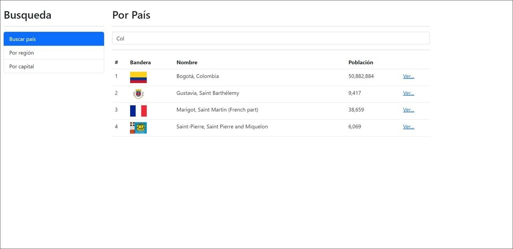
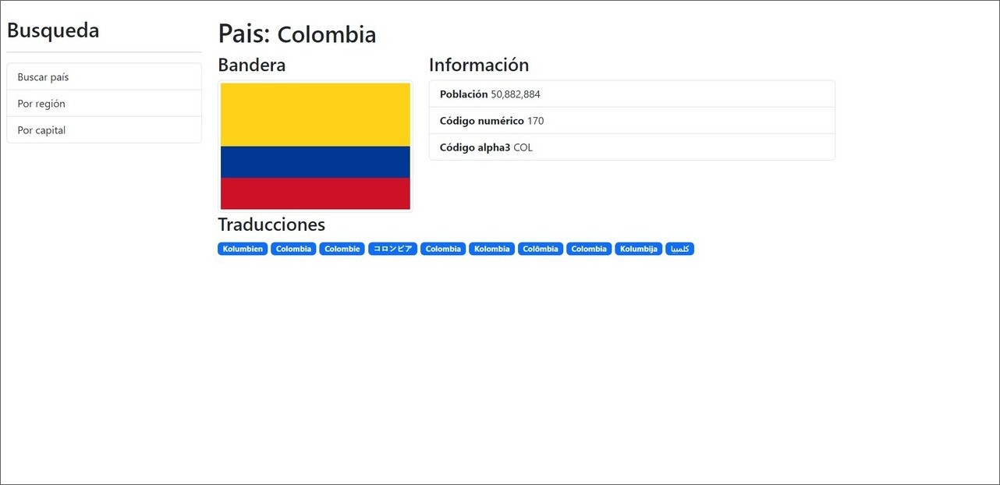
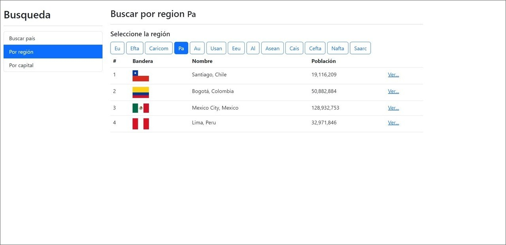
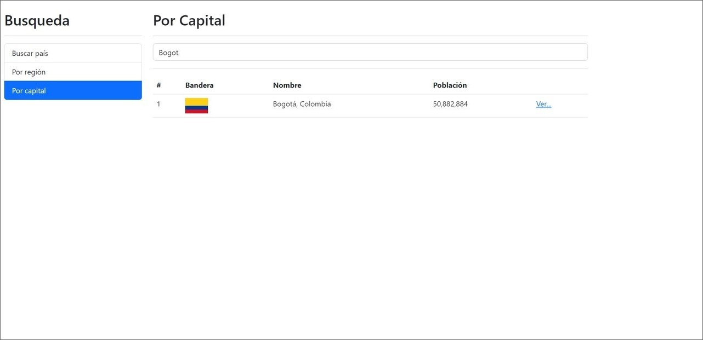

# Búsqueda de Países

Este proyecto es una página web creada con Angular que permite buscar datos relevantes sobre países, regiones y capitales. Utiliza la API https://restcountries.com/ para obtener los datos y Bootstrap 5 para los estilos.

## Tecnologías principales
-  Angular  
-  Bootstrap 5  
- API https://restcountries.com/

## Capturas de pantalla
Se pueden ver las capturas de pantalla en dispositivos desktop.

## Créditos
Este proyecto fue creado a partir del curso de Udemy "Angular: De cero a experto" dictado por Fernando Herrera. Puedes encontrar el curso en el siguiente enlace: https://www.udemy.com/course/angular-fernando-herrera/.

## Enlace
Puedes ver la página web aquí: https://paises-angular-yha.netlify.app/
